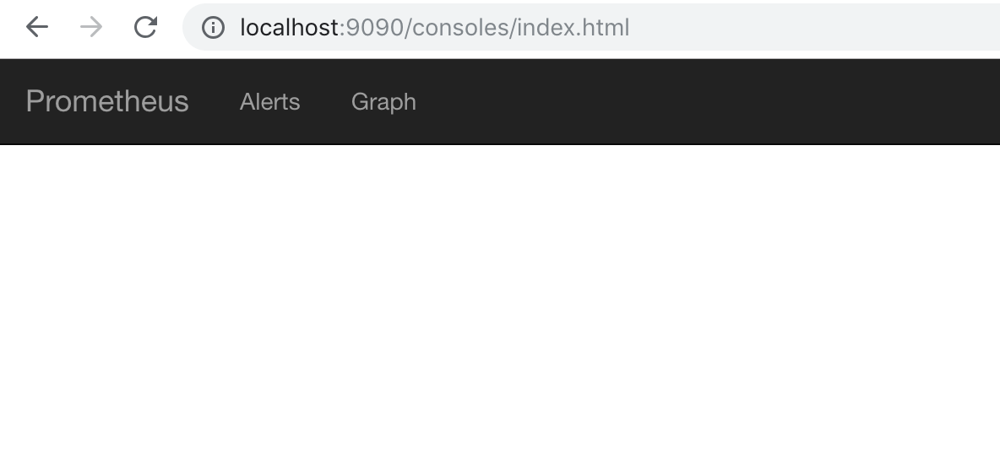
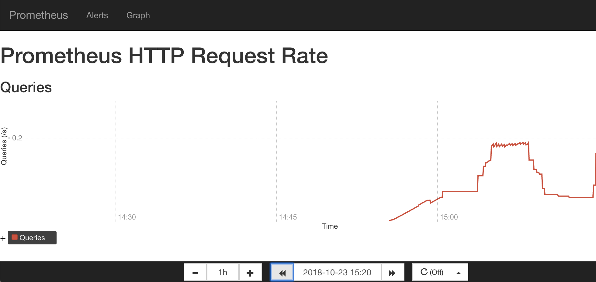

# 使用Console Template

在第1章以及第2章的内容中，读者已经对Prometheus已经有了一个相对完成的认识，并且我们已经学习了如何通过PromQL对时间序列数据进行查询和分析，并且通过Prometheus中的Graph面板查询数据形成图表。但是确定也很明显，这些查询结果都是临时的，无法持久化的，更别说我们想实时关注某些特定监控指标的变化趋势。

为了简化这些问题Prometheus内置了一个简单的解决方案`Console Template`,它允许用户通过Go模板语言创建任意的控制台界面，并且通过Prometheus Server对外提供访问路径。

## 快速开始

首先我们先从一个小例子开始，创建我们的第一个Console Template页面。与Console Template有关的两个启动参数为`--web.console.libraries`和`--web.console.templates`,其分别指定页面组件以及页面的存储路径。默认情况下其分别指向Prometheus当前安装路径的`console_libraries`和`consoles`目录。

Prometheus在`console_libraries`目录中已经内置了一些基本的界面组件，用户可以直接使用。

在`consoles`目录下创建index.html文件后，刷新Prometheus界面可以看到在顶部菜单中多了一个Consoles菜单项，如下所示。该选项默认指向`consoles/index.html`文件：


当然，这个时候点击该菜单，我们会看到一个空白页。因为目前index.html文件中还未填充任何内容：

## 定义页面菜单

首先，我们先直接使用console_libraries中定义的`head`组件，并加入到index.html文件中：

```
{{template "head" .}}
```

此时，如果我们刷新浏览器可以看到以下内容：


`head`组件的定义，读者可以通过关键字`define "head"`在console_libraries目录中查找。默认其应该是定义在`prom.lib`文件中：

``` go
{{ define "head" }}
<html>
<head>
{{ template "prom_console_head" }}
</head>
<body>
{{ template "navbar" . }}
{{ end }}
```

如果需要定制化菜单的内容，那一样的读者只需要找到`navbar`组件的定义即可。当然用户也可以创建自己的组件。 例如，如果我们希望Console Template页面的菜单与Prometheus UI一致，只需要修改navbar组件的定义即可，找到`menu.lib`并修改navbar组件:

```
{{ define "navbar" }}
<nav class="navbar navbar-inverse navbar-static-top">
  <div class="container-fluid">
    <!-- Brand and toggle get grouped for better mobile display -->
    <div class="navbar-header">
      <button type="button" class="navbar-toggle collapsed" data-toggle="collapse" data-target="#bs-example-navbar-collapse-1">
        <span class="sr-only">Toggle navigation</span>
        <span class="icon-bar"></span>
        <span class="icon-bar"></span>
        <span class="icon-bar"></span>
      </button>
      <a class="navbar-brand" href="{{ pathPrefix }}/">Prometheus</a>
    </div>

    <div class="collapse navbar-collapse" id="bs-example-navbar-collapse-1">
      <ul class="nav navbar-nav">
        <li><a href="{{ pathPrefix }}/alerts">Alerts</a></li>
        <li><a href="{{ pathPrefix }}/graph">Graph</a></li>
      </div>
    </ul>
  </div>
</nav>
{{ end }}
```

如果不需要侧边菜单栏，直接在head组件中移除`{{ template "menu" . }}`部分即可，修改后刷新页面，如下所示：



无论是`.lib`文件还是`.html`文件均使用了Go Template的语言，感兴趣的读者可以自行在Go语言官网了解更多内容`https://golang.org/pkg/text/template/`

## 定义图表

在Console Template中我们可以在页面中使用内置的`PromConsole.Graph()`函数，该函数通过`head`加载相应的js源码，在该函数中，通过指定特定的DOM节点以及相应的PromQL表达式，即可在特定区域图形化显示相应的图表内容，如下所示：

```
<h1>Prometheus HTTP Request Rate</h1>

<h3>Queries</h3>
<div id="queryGraph"></div>
<script>
new PromConsole.Graph({
  node: document.querySelector("#queryGraph"),
  expr: "sum(rate(prometheus_http_request_duration_seconds_count{job='prometheus'}[5m]))",
  name: "Queries",
  yAxisFormatter: PromConsole.NumberFormatter.humanizeNoSmallPrefix,
  yHoverFormatter: PromConsole.NumberFormatter.humanizeNoSmallPrefix,
  yUnits: "/s",
  yTitle: "Queries"
})
</script>
```

这里创建了一个id为queryGraph的div节点，通过在页面中使用PromConsole.Graph函数，我们可以绘制出表达式`sum(rate(prometheus_http_request_duration_seconds_count{job='prometheus'}[5m]))`的可视化图表如下所示：


除了最基本的node以及expr参数以外，该函数还支持的完整参数如下：

|参数名称|作用|
|---|-------|
|expr| Required. Expression to graph. Can be a list. |
|node| Required. DOM node to render into. |
|duration| Optional. Duration of the graph. Defaults to 1 hour.|
|endTime| Optional. Unixtime the graph ends at. Defaults to now.|
|width| Optional. Width of the graph, excluding titles. Defaults to auto-detection.|
|height|Optional. Height of the graph, excluding titles and legends. Defaults to 200 pixels.|
|min|Optional. Minimum x-axis value. Defaults to lowest data value.|
|max|Optional. Maximum y-axis value. Defaults to highest data value.|
|renderer|	Optional. Type of graph. Options are line and area (stacked graph). Defaults to line.|
|name|Optional. Title of plots in legend and hover detail. If passed a string, [[ label ]] will be substituted with the label value. If passed a function, it will be passed a map of labels and should return the name as a string. Can be a list.|
|xTitle|Optional. Title of the x-axis. Defaults to Time.|
|yUnits|Optional. Units of the y-axis. Defaults to empty.|
|yTitle|Optional. Title of the y-axis. Defaults to empty.|
|yAxisFormatter|Optional. Number formatter for the y-axis. Defaults to PromConsole.NumberFormatter.humanize.|
|yHoverFormatter|Optional. Number formatter for the hover detail. Defaults to PromConsole.NumberFormatter.humanizeExact.|
|colorScheme|Optional. Color scheme to be used by the plots. Can be either a list of hex color codes or one of the color scheme names supported by Rickshaw. Defaults to 'colorwheel'.|

需要注意的是，如果参数`expr`和`name`均是list类型，其必须是一一对应的。

除了直接使用`PromConsole.Graph`函数显示可视化图表以外，在Console Template中还可以使用模板组件`prom_query_drilldown`定义一个连接直接跳转到Graph页面，并显示相应表达式的查询结果， 如下所示：

```
<h3>Links</h3>
{{ template "prom_query_drilldown" (args "prometheus_http_response_size_bytes_bucket") }}
```

除了以上部分以外，我们也可以和原生Prometheus UI一样定义一个时间轴控制器，方便用户按需查询数据：



加入这个时间轴控制器的方式也很简单，直接引用以下模板即可：

```
{{ template "prom_graph_timecontrol" . }}
```

