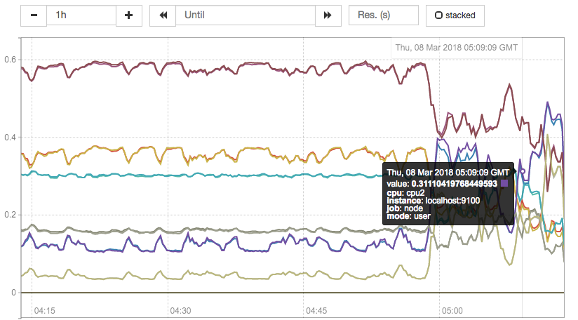

# 远程存储

Prometheus的本地存储设计可以减少其自身运维和管理的复杂度，同时能够满足大部分用户监控规模的需求。但是本地存储也意味着Prometheus无法持久化数据，无法存储大量历史数据，同时也无法灵活扩展和迁移。

为了保持Prometheus的简单性，Prometheus并没有尝试在自身中解决以上问题，而是通过定义两个标准接口(remote_write/remote_read)，让用户可以基于这两个接口对接将数据保存到任意第三方的存储服务中，这种方式在Promthues中称为Remote Storage。

## Remote Write

用户可以在Prometheus配置文件中指定Remote Write(远程写)的URL地址，一旦设置了该配置项，Prometheus将采集到的样本数据通过HTTP的形式发送给适配器(Adaptor)。而用户则可以在适配器中对接外部任意的服务。外部服务可以是真正的存储系统，公有云的存储服务，也可以是消息队列等任意形式。


## Remote Read

如下图所示，Promthues的Remote Read(远程读)也通过了一个适配器实现。在远程读的流程当中，当用户发起查询请求后，Promthues将向remote_read中配置的URL发起查询请求(matchers,ranges)，Adaptor根据请求条件从第三方存储服务中获取响应的数据。同时将数据转换为Promthues的原始样本数据返回给Prometheus Server。

当获取到样本数据后，Promthues在本地使用PromQL对样本数据进行二次处理。

> 注意：启用远程读设置后，只在数据查询时有效，对于规则文件的处理，以及Metadata API的处理都只基于Prometheus本地存储完成。


### 配置文件

Prometheus配置文件中添加remote_write和remote_read配置，其中url用于指定远程读/写的HTTP服务地址。如果该URL启动了认证则可以通过basic_auth进行安全认证配置。对于https的支持需要设定tls_concig。proxy_url主要用于Prometheus无法直接访问适配器服务的情况下。

remote_write和remote_write具体配置如下所示：

```
remote_write:
    url: <string>
    [ remote_timeout: <duration> | default = 30s ]
    write_relabel_configs:
    [ - <relabel_config> ... ]
    basic_auth:
    [ username: <string> ]
    [ password: <string> ]
    [ bearer_token: <string> ]
    [ bearer_token_file: /path/to/bearer/token/file ]
    tls_config:
    [ <tls_config> ]
    [ proxy_url: <string> ]

remote_read:
    url: <string>
    required_matchers:
    [ <labelname>: <labelvalue> ... ]
    [ remote_timeout: <duration> | default = 30s ]
    [ read_recent: <boolean> | default = false ]
    basic_auth:
    [ username: <string> ]
    [ password: <string> ]
    [ bearer_token: <string> ]
    [ bearer_token_file: /path/to/bearer/token/file ]
    [ <tls_config> ]
    [ proxy_url: <string> ]
```

## 自定义Remote Storage Adaptor

实现自定义Remote Storage需要用户分别创建用于支持remote_read和remote_write的HTTP服务。


当前Prometheus中Remote Storage相关的协议主要通过以下proto文件进行定义：

```
syntax = "proto3";
package prometheus;

option go_package = "prompb";

import "types.proto";

message WriteRequest {
  repeated prometheus.TimeSeries timeseries = 1;
}

message ReadRequest {
  repeated Query queries = 1;
}

message ReadResponse {
  // In same order as the request's queries.
  repeated QueryResult results = 1;
}

message Query {
  int64 start_timestamp_ms = 1;
  int64 end_timestamp_ms = 2;
  repeated prometheus.LabelMatcher matchers = 3;
}

message QueryResult {
  // Samples within a time series must be ordered by time.
  repeated prometheus.TimeSeries timeseries = 1;
}
```

以下代码展示了一个简单的remote_write服务，创建用于接收remote_write的HTTP服务，将请求内容转换成WriteRequest后，用户就可以按照自己的需求进行后续的逻辑处理。

```
package main

import (
	"fmt"
	"io/ioutil"
	"net/http"

	"github.com/gogo/protobuf/proto"
	"github.com/golang/snappy"
	"github.com/prometheus/common/model"

	"github.com/prometheus/prometheus/prompb"
)

func main() {
	http.HandleFunc("/receive", func(w http.ResponseWriter, r *http.Request) {
		compressed, err := ioutil.ReadAll(r.Body)
		if err != nil {
			http.Error(w, err.Error(), http.StatusInternalServerError)
			return
		}

		reqBuf, err := snappy.Decode(nil, compressed)
		if err != nil {
			http.Error(w, err.Error(), http.StatusBadRequest)
			return
		}

		var req prompb.WriteRequest
		if err := proto.Unmarshal(reqBuf, &req); err != nil {
			http.Error(w, err.Error(), http.StatusBadRequest)
			return
		}

		for _, ts := range req.Timeseries {
			m := make(model.Metric, len(ts.Labels))
			for _, l := range ts.Labels {
				m[model.LabelName(l.Name)] = model.LabelValue(l.Value)
			}
			fmt.Println(m)

			for _, s := range ts.Samples {
				fmt.Printf("  %f %d\n", s.Value, s.Timestamp)
			}
		}
	})

	http.ListenAndServe(":1234", nil)
}
```

## 使用Influxdb作为Remote Storage

目前Prometheus社区也提供了部分对于第三方数据库的Remote Storage支持：

| 存储服务                  | 支持模式 |
|---------------- ---------|-------|
| AppOptics                | write |
| Chronix                  | write |
| Cortex:                  | read/write |
| CrateDB                  | read/write|
| Gnocchi                  | write|
| Graphite                 | write|
| InfluxDB                 | read/write|
| OpenTSDB                 | write|
| PostgreSQL/TimescaleDB:  | read/write|
| SignalFx                 | write|

这里将介绍如何使用Influxdb作为Prometheus的Remote Storage，从而确保当Prometheus发生宕机或者重启之后能够从Influxdb中恢复和获取历史数据。

这里使用docker-compose定义并启动Influxdb数据库服务，docker-compose.yml定义如下：

```
version: '2'
services:
  influxdb:
    image: influxdb:1.3.5
    command: -config /etc/influxdb/influxdb.conf
    ports:
      - "8086:8086"
    environment:
      - INFLUXDB_DB=prometheus
      - INFLUXDB_ADMIN_ENABLED=true
      - INFLUXDB_ADMIN_USER=admin
      - INFLUXDB_ADMIN_PASSWORD=admin
      - INFLUXDB_USER=prom
      - INFLUXDB_USER_PASSWORD=prom
```

启动influxdb服务

```
$ docker-compose up -d
$ docker ps
CONTAINER ID        IMAGE               COMMAND                  CREATED             STATUS              PORTS                    NAMES
795d0ead87a1        influxdb:1.3.5      "/entrypoint.sh -c..."   3 hours ago         Up 3 hours          0.0.0.0:8086->8086/tcp   localhost_influxdb_1
```

获取并启动Prometheus提供的Remote Storage Adapter：

```
go get github.com/prometheus/prometheus/documentation/examples/remote_storage/remote_storage_adapter
```

获取remote_storage_adapter源码后，go会自动把相关的源码编译成可执行文件，并且保存在$GOPATH/bin/目录下。

启动remote_storage_adapter并且设置Influxdb相关的认证信息：

```
INFLUXDB_PW=prom $GOPATH/bin/remote_storage_adapter -influxdb-url=http://localhost:8086 -influxdb.username=prom -influxdb.database=prometheus -influxdb.retention-policy=autogen
```

修改prometheus.yml添加Remote Storage相关的配置内容：

```
remote_write:
  - url: "http://localhost:9201/write"

remote_read:
  - url: "http://localhost:9201/read"
```

重新启动Prometheus能够获取数据后，登录到influxdb容器，并验证数据写入。如下所示，当数据能够正常写入Influxdb后可以看到Prometheus相关的指标。

```
docker exec -it 795d0ead87a1 influx
Connected to http://localhost:8086 version 1.3.5
InfluxDB shell version: 1.3.5
> auth
username: prom
password:

> use prometheus
> SHOW MEASUREMENTS
name: measurements
name
----
go_gc_duration_seconds
go_gc_duration_seconds_count
go_gc_duration_seconds_sum
go_goroutines
go_info
go_memstats_alloc_bytes
go_memstats_alloc_bytes_total
go_memstats_buck_hash_sys_bytes
go_memstats_frees_total
go_memstats_gc_cpu_fraction
go_memstats_gc_sys_bytes
go_memstats_heap_alloc_bytes
go_memstats_heap_idle_bytes
```

当数据写入成功后，停止Prometheus服务。同时删除Prometheus的data目录，模拟Promthues数据丢失的情况后重启Prometheus。打开Prometheus UI如果配置正常，Prometheus可以正常查询到本地存储以删除的历史数据记录。

